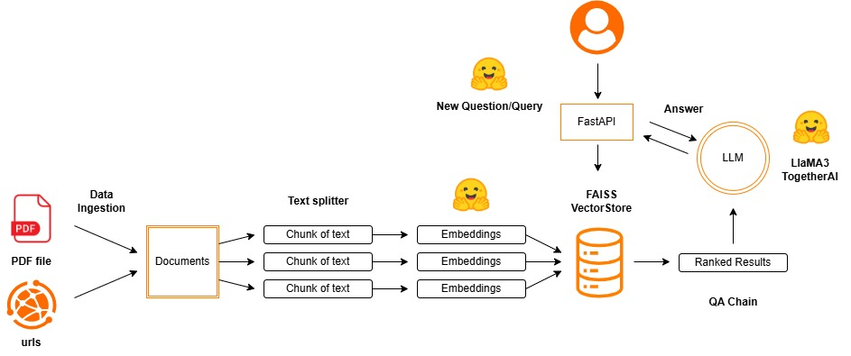

# Promtior RAG Chatbot - Technical Test

## Technical requirements
### Functionality
* The chatbot should be able to answer the following questions:
- What services does Promtior offer?
- When was the company founded?

### Technologies to be used
* Implement the solution using LangChainwith Langserve:
* Use the OpenAI API if you have a subscription, otherwise, you can use Ollamaand LlaMA2 as explained in the LangChain documentation.

### Deployment
* Deploy the solution on a cloud of your choice (AWS, Azure).
- Tip: although using one of the mentioned clouds is valued, you can use Railway to facilitate the deployment.

## 📄 Project Overview

This project implements a RAG (Retrieval-Augmented Generation) chatbot assistant for Promtior using LangChain, FAISS, and FastAPI. The objective was to create a solution that allows users to ask questions about the company and receive intelligent, context-aware responses based on both unstructured data from PDFs and website URLs.

### ✅ Approach
After reading the documentation of the requested technologies: 

1. **Document Ingestion**: I created an `ingest.py` script that loads content from the Promtior website and a PDF document, splits it into chunks using `RecursiveCharacterTextSplitter`, generates embeddings using `HuggingFaceEmbeddings`, and stores them in a FAISS index.
2. **Chatbot Application**: A FastAPI app (`app.py`) handles user queries by embedding the question, searching for relevant chunks in the FAISS index, and using a LLM (via Together.ai - model: LlaMA3) to answer based on retrieved context.
3. **Frontend**: A simple HTML form captures the user’s question and displays the chatbot’s response.

### ⚡ Technologies Used

* **Python** (3.10): Main language of the project.
* **LangChain** (v0.3.25): Chain orchestration.
* **HuggingFaceEmbeddings**: Embedding generation.
* **FAISS**: Vector similarity search.
* **FastAPI**: Backend framework.
* **Jinja2**: Frontend (templating engine).
* **Together.ai**: LLM inference endpoint.
* **EC2 (AWS)**: Hosting and deployment.

### ⚠️ Challenges & Solutions

* **Hardware Limitations**: When attempting to run the LLaMA 2 model locally using Ollama, it became apparent that the model required more than 8 GB of RAM, which exceeded the available resources in the local testing environment and caused performance issues. **Solution:** To address this, a cloud-hosted LLM was adopted. The project integrated TogetherLLM, which allows interacting with language models through an API that runs on Together AI servers, offloading all computational demands from the local environment.
* **LLM Model Migration**: Upon switching to TogetherLLM, it was discovered that LLaMA 2 was not freely available on the platform. **Solution:** The model was replaced with LLaMA 3, which is free and accessible via TogetherLLM, ensuring the project could continue without incurring additional costs.
* **Session separation**: Initially all sessions shared history. **Solution:** Assign a unique user ID per session.
* **Port access issues**: Solved by editing the EC2 security group to open port `8000` to all IPs (0.0.0.0/0).

## 🔍 Component Diagram



## Diagram Description

### Document Processing 📄
1. **Load PDFs and URLS**:
   - Save the PDFs in the docs folder
   - Save the PDFs and urls in the .env file
   - When running ingest.py each document is processed.
   - Texts are extracted and segmented into optimized chunks

2. **Indexing**:
   - Each segment is turned into embeddings (numerical values)
   - They are stored in the faiss vector
   - Metadata and references are preserved

### Query Flow
1. **User**: submits a question via browser.
2. **FastAPI (app.py)**: receives the question and computes the embedding.
3. **FAISS Vector DB**: retrieves the top-k relevant document chunks.
4. **Together.ai**: LLM receives the context and the user question to generate a response.
5. **FastAPI**: returns the final response to the **User**.

## 📚 How to Run

### 1. Clone the Repository

```bash
git clone https://github.com/CelesteOj22/Promtior-RAG-Chatbot.git
cd Promtior-RAG-Chatbot
```

### 2. Set Up Environment

```bash
python3 -m venv venv
source venv/bin/activate
pip install -r requirements.txt
```

### 3. Create `.env` File

Create a `.env` file in the root with this content:

```ini
SCRAPE_URLS=https://www.promtior.ai/,https://www.promtior.ai/service
PDF_PATH=AI Engineer.pdf
VECTOR_INDEX_PATH=promtior_index
TOGETHER_API_KEY=your_together_ai_api_key
```

### 4. Ingest Documents

```bash
cd Promtior-RAG-Chatbot/docs
python ingest.py
```

### 5. Start the Application

```bash
uvicorn app:app --host 0.0.0.0 --port 8000
```

Now visit `http://<your-ec2-public-ip>:8000` from any browser.

---

For any questions or contributions, feel free to open an issue or submit a PR!
